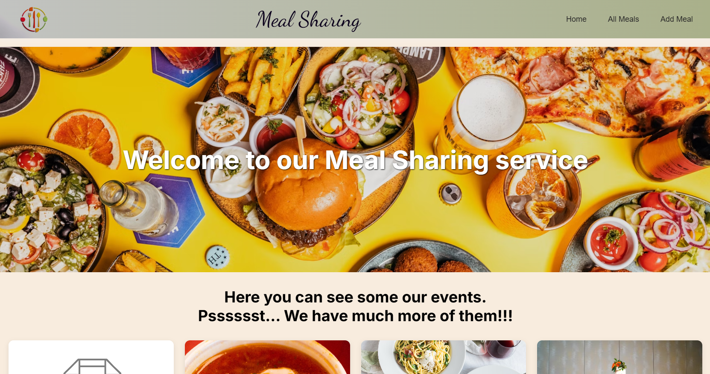

# Meal Sharing App
Check the website in this [[link](https://meal-sharing-seven.vercel.app/)]

## About this project

This i a full-stack web application built with React, NextJS, NodeJS, MySQL. 

This project was created during my studying at [[HackYourFuture](https://www.hackyourfuture.dk)] Aarhus.

The database and backend were deployed on [[Railway](https://railway.com/)] and frontend on [[Vercel](https://vercel.com)]

This website offers such options as:

  - Showing of meals on main page and page of All meals

  - Sorting of meals by price, date and available reservations

  - Creating of the new meal sharing event

  - Adding reservation to the event

  - Adding/deleting review to the event

## Technologies, used in the project

  - ReactJs

  - NextJS

  - NodeJs

  - ExpressJs

  - Knex

  - MySQL

  - Styled Components and CSS Modules

  - Axios 

  - Sweetalert2

  - React-hook-form

## Screenshots

 

 

 

